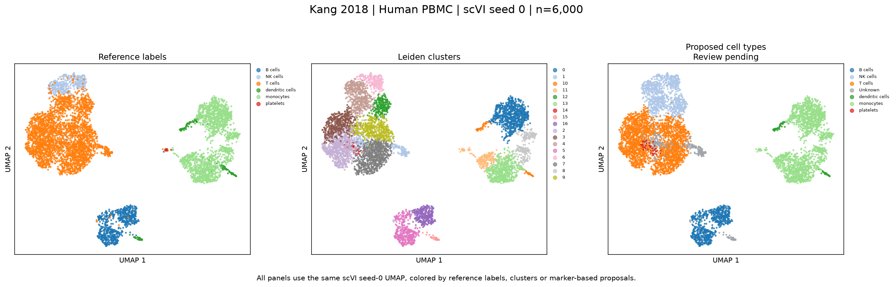

# scRNA-seq Workbench

An agent plugin for single-cell RNA-seq analysis, with five Skills and a shared
Python runner. Use it with **Codex**, **Claude Code** or **DeepSeek Harness**.
Version **0.2.1 - research preview**.

Give your assistant a count matrix, sample information and an analysis goal.
The Skills guide it through inspecting your files, explaining parameter choices,
running the analysis and reviewing the results with you.

## Get started

1. Follow the [installation tutorial](docs/INSTALLATION.md): Windows and Linux/macOS instructions, Python dependencies and common errors.
2. Enable the plugin in [your assistant](docs/HOSTS.md).
3. Run the [400-cell example](docs/QUICKSTART.md) to check your setup.
4. Follow [Analyze your own data](docs/USAGE.md) for file preparation, parameter choices and the five analysis stages.

Installing the plugin adds instructions and scripts. Its calculations use a
Python environment on your computer or server. scVI and differential expression
have additional dependencies described in the installation tutorial.

## What it does

| Skill | What you provide | What you receive |
|---|---|---|
| `sequencing-report-review` | Vendor report and sample details | A summary of sequencing metrics, source evidence and missing files |
| `scrna-qc` | UMI counts, species and sample metadata | QC measurements, filtering records and a filtered H5AD |
| `scrna-scvi-umap` | Filtered counts and a batch definition if needed | scVI or PCA representation, Leiden clusters and UMAP plots |
| `scrna-cell-annotation` | Clusters and a tissue-matched marker panel or HPA table | Candidate cell types, marker evidence and a review form |
| `scrna-condition-de` | Reviewed cell types, conditions and biological donor IDs | Donor-level pseudobulk counts and PyDESeq2 results |

You can use one Skill or work through the stages. A sequencing report alone is
enough for delivery review; downstream analysis also needs the count matrix.

## A first request

> Use scRNA-seq Workbench to inspect my human PBMC data.
> Counts: D:/my-study/data/raw.h5ad.
> Cell metadata: D:/my-study/data/cells.csv.
> Python: D:/scrna-seq-workbench/.venv/Scripts/python.exe.
> My goal is broad cell-type annotation. Save results under D:/my-study/runs.
> Start with input checks and QC inspection. Explain the proposed filters,
> dimensionality and batch settings before running the full analysis.

Change the paths and biological details to match your project. The assistant can
answer in your language. If you want it to choose parameters, state that in your
request and it should record the choices and their reasons.

## Inputs and scope

Supported inputs are human or mouse UMI counts in H5AD, 10x H5 or 10x-compatible
matrix directories. Each run records parameters, package versions and file hashes.
Original counts are preserved in `layers['counts']` after the declared QC exclusions.

This version starts from count matrices or sequencing reports. FASTQ alignment,
multi-matrix assembly, ambient-RNA correction and arbitrary DE covariates require
additional tools. HPA reference tables are optional and supplied by the user.
See the [input requirements](docs/USAGE.md) before using an existing H5AD.

## Examples and evaluation

[Five-study comparisons](docs/COMPARISONS.md) show published figures alongside our
UMAPs and annotation proposals for Kang, Haber, Paul, Zeisel and Baron. The three
panels in each of our plots share coordinates, showing reference labels, Leiden
clusters and proposed labels. Three published figures are available inline;
Paul and Zeisel have source links because the image downloads were unavailable.

The benchmark exposed loss of low-RNA populations, ambiguous labels and missed
rare types. Its scores describe the historical fixed-parameter workflow.
The current annotation step adds [HPA-guided review](docs/HPA_METHODS.md);
the five benchmark review forms are still pending.

Read [validation](docs/VALIDATION.md) for the measured results and remaining work,
or [benchmark verification](benchmarks/README.md) to check the frozen source and
published tables. [The review response](docs/REVIEW_FIXES.md) records the v0.2.1 corrections.

## Contributing

See [development and release instructions](docs/DEVELOPMENT.md),
[the changelog](CHANGELOG.md) and [GitHub Actions](https://github.com/Sculptor815/scrna-seq-workbench/actions).
Code is MIT licensed. Dataset and publication attribution is documented in
[Third-party sources](docs/THIRD_PARTY_SOURCES.md).
