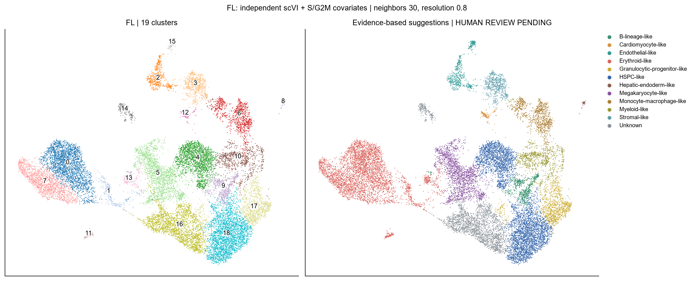
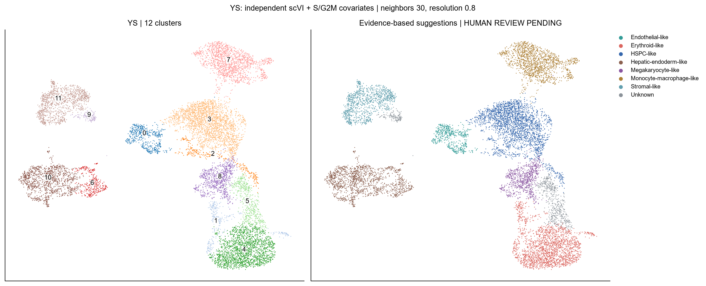
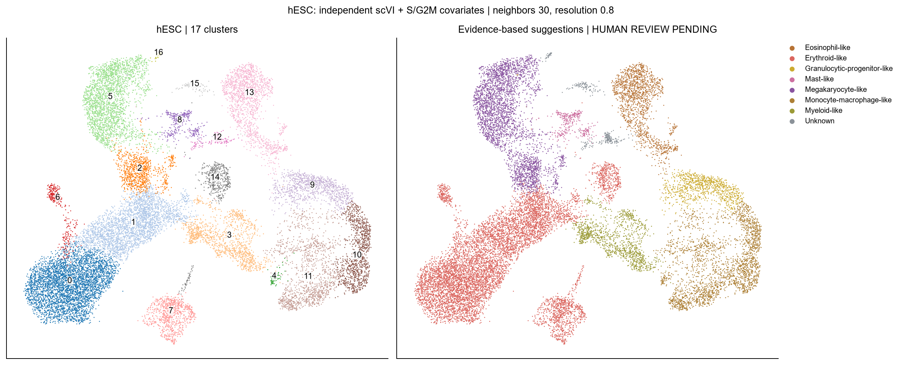
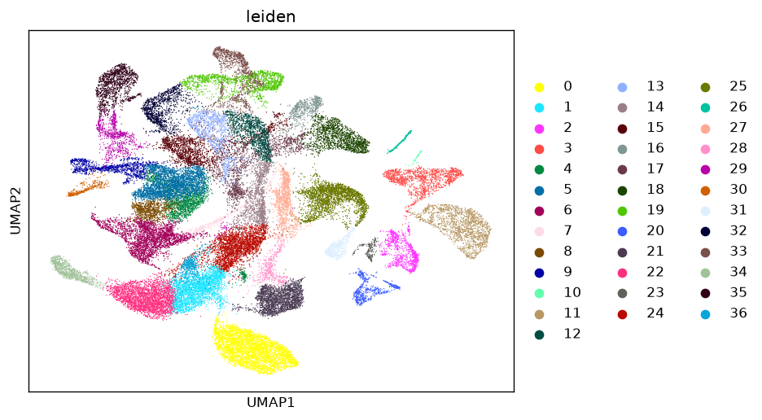
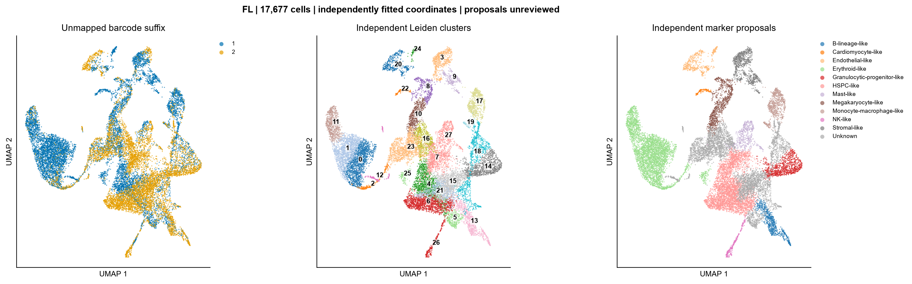
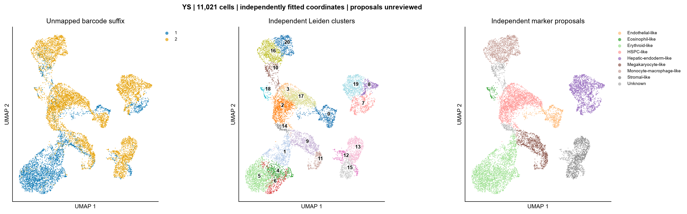
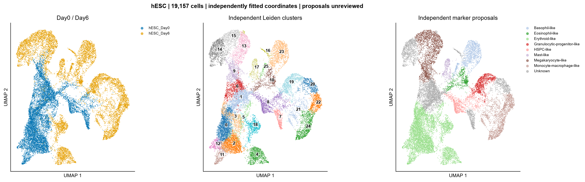
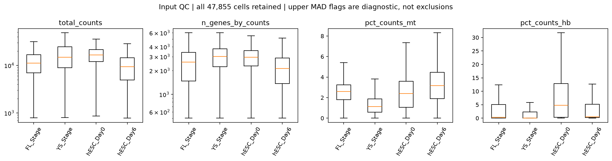

# scRNA-seq Workbench

Version **0.4.0 — with knowledge base · research preview**.

A single-cell RNA-seq analysis plugin for **Codex**, **Claude Code** and
**DeepSeek Harness**. Workbench combines executable analysis tools with a bundled
knowledge base covering study design, quality control, scVI, cell annotation and
differential expression.

## Analysis workflow

Start with your data or a biological question. The agent checks sample relationships,
defines which datasets to analyze together, and runs the relevant stages.

| Stage | Skill | Main outputs |
|---|---|---|
| Study selection and exploration | `scrna-research` | Relevant studies, experimental context and expression summaries |
| Sequencing report review | `sequencing-report-review` | Sequencing metrics and delivery checks |
| Quality control | `scrna-qc` | QC plots, filtering records, doublet assessment when applicable and filtered counts |
| Representation and clustering | `scrna-scvi-umap` | scVI model or selected Harmony embedding, cell-cycle diagnostics, candidate clusters and UMAPs |
| Cell annotation | `scrna-cell-annotation` | Marker expression, candidate cell types and human review records |
| Condition comparison | `scrna-condition-de` | Donor-level pseudobulk counts and differential-expression results |

New representation workflows default to **scVI with cell-cycle covariates**, with
or without technical batches. Users may explicitly choose Harmony for verified
technical batches; that route regresses cell-cycle scores before PCA. Raw counts
and the full retained gene set are preserved.

Several neighbor counts and Leiden resolutions are presented for selection.
Annotation follows tissue-specific marker evidence and HPA-guided review, with
additional investigation of unresolved populations. Final labels require human
review; condition DE requires biological donor replicates and reviewed annotations.

Use `scrna-research` to plan an analysis, or enter a specific stage when suitable
intermediate results already exist.

## Runtime and backend choice

**The complete pipeline may take more than 1 hour. scVI remains the default.**
Runtime depends on cell/gene counts, hardware, training, parameter comparisons
and annotation review; this is not a completion-time estimate.

| Your environment or preference | Route |
|---|---|
| Compatible CUDA GPU available to PyTorch | Use scVI; `--device auto` selects the available GPU. |
| No compatible GPU; willing to wait longer | Keep scVI on CPU. It is supported, but training can take substantially longer. |
| Prefer a CPU alternative | Explicitly choose Harmony via the Python package `harmonypy` (`--backend harmony`). Verified technical batches are required. |

The backend never switches automatically because a GPU or package is missing,
training is slow, or a run fails. Without another choice, use scVI. Harmony
adjusts PCA coordinates and often takes less time, but does not guarantee an
under-one-hour run or equivalent biological results. With no justified technical
batch, keep no-batch scVI; do not invent a batch or relabel plain PCA as Harmony.

Install `requirements-scvi.txt` for scVI or `requirements-harmony.txt` for Harmony.
See [backend examples and outputs](docs/USAGE.md#3-compute-a-representation-clusters-and-umap).

### Why default to scVI rather than direct PCA + UMAP?

Workbench's scVI models raw counts with a **negative-binomial likelihood** and
learns a nonlinear cell representation, accounting for library size and registered
batch/cell-cycle factors. These capabilities can help distinguish biological
structure from count variability. Ordinary PCA summarizes linear variation in
preprocessed expression without that count model. Both routes still use a
neighbor graph followed by UMAP for visualization.

scVI takes longer and is not guaranteed to outperform PCA on every dataset.
Review marker support and biological conservation, not just UMAP appearance.
See the [method comparison and sources](collaboration/knowledgebase/README.md#14-explain-scvi-versus-a-direct-pca-to-umap-workflow).

## Bundled knowledge base

The [knowledge base](collaboration/knowledgebase/README.md) defines how the agent
groups datasets, chooses parameters, investigates uncertain annotations and reports
results. All six Skills point to the relevant sections.

It ships inside the plugin. Synchronization checks prevent outdated copies, and
each run records the policy hash with its parameters and software versions.
See [how agents use the knowledge base](docs/AGENT_KNOWLEDGE.md).

## Get started

1. [Install the plugin and dependencies](docs/INSTALLATION.md), then
   [connect it to your agent](docs/HOSTS.md).
2. Run the [400-cell example](docs/QUICKSTART.md) to check your environment.
3. Follow the [research workflow](docs/RESEARCH_WORKFLOW.md) or
   [analyze your own data](docs/USAGE.md).

Calculations run in your local or server Python environment. Install
`requirements-scvi.txt` for default scVI, or `requirements-harmony.txt` for selected
Harmony; condition DE has additional dependencies.

Example request:

> Analyze these datasets with scRNA-seq Workbench. Read the knowledge base,
> establish the analysis groups, and run QC and scVI. Show clustering options
> for my selection and marker-expression figures for annotation review.
> Save the analysis records and figures in my project directory.

## Analysis reports and validation

### GSE144024: analysis results

#### Manual analysis

##### FL

##### YS

##### hESC

#### Workbench v0.4.0 — scVI

##### FL

##### YS

##### hESC

#### Workbench v0.3.0 — Analysis 1: joint

#### Workbench v0.3.0 — Analysis 2: independent

##### FL

##### YS

##### hESC

#### Quality control

### Current software checks

Version 0.4.0 passed **50 local tests**, including CPU scVI training with and
without batches, real Harmony, count/expression preservation, cell-cycle handling,
model save/reload, candidate graphs and backend/device dispatch. GPU availability
was simulated for dispatch tests; actual GPU training was not tested. Package checks cover knowledge-base
synchronization, Skill entry points and standalone installation files.

These synthetic tests assess execution, not biological annotation accuracy.
See the [validation record](validation.json), [validation details](docs/VALIDATION.md)
and [CI results](https://github.com/Sculptor815/scrna-seq-workbench/actions).
Earlier [five-study analyses](docs/COMPARISONS.md) remain available as historical results.

## Development

[Development guide](docs/DEVELOPMENT.md) · [Changelog](CHANGELOG.md) ·
[Collaboration](collaboration/README.md) · [Data and publication sources](docs/THIRD_PARTY_SOURCES.md)

Code is MIT licensed.
