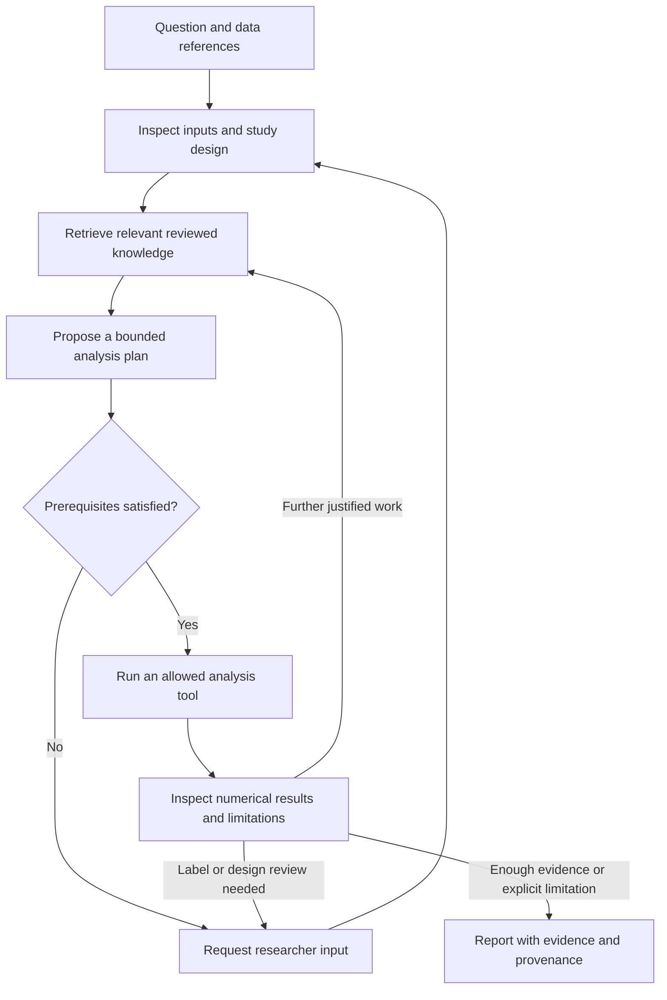

# scRNA-seq agent development plan

Status: proposed architecture and implementation milestones, 2026-10-06.
The owner confirmed scRNA-seq as the first scope. This document does not announce
an implemented agent, an installed framework stack, or a new release.

## Product goal

Start with the researcher's biological question, determine what the available
data can support, execute appropriate analyses, and deliver evidence, limitations
and reproducible outputs. The agent may reuse documented intermediate results;
it should not run every stage simply because it is available.

The existing v0.3 analysis plugin, CLI and six canonical Skills remain the
execution foundation. The local test environment has run synthetic checks;
real-data scientific acceptance and the autonomous application remain separate.

## Framework responsibilities

| Component | Proposed responsibility | Boundary |
|---|---|---|
| LangChain | Provider adapters, model messages and tool schemas | No independent second analysis loop |
| LangGraph | Explicit workflow state, branching, checkpoints and researcher interrupts | Checkpointing alone does not make external calls or computations safe to replay |
| LlamaIndex | Ingest approved knowledge, retrieve passages and retain source metadata | Start with retrieval results; no separate agent deciding or executing analyses |
| Existing Python runner | Numerical analysis in an independent process | Fixed allowed operations and validated parameter lists; no model-supplied shell |
| Streamlit | Local project intake, progress, review and report views | Bind to 127.0.0.1 initially; UI refreshes must not resubmit jobs |
| SQLite | Run, action, artifact, review and usage records | Secrets excluded; framework checkpoints and job state have explicit ownership |

LangChain agents themselves use LangGraph. We will choose one application-owned
graph and reuse model/tool components rather than nest autonomous loops from
both frameworks. LlamaIndex also supports agents, but its planned role here is
retrieval. Framework choices will be validated in an isolated environment before
exact versions are pinned; no untested version combination is specified here.

Official references, checked 2026-10-06:
[LangChain](https://docs.langchain.com/oss/python/langchain/overview),
[LangGraph](https://docs.langchain.com/oss/python/langgraph/overview),
[LlamaIndex](https://developers.llamaindex.ai/python/framework/understanding/),
[LlamaIndex retrievers](https://developers.llamaindex.ai/python/framework/module_guides/querying/retriever/).

## Question-driven execution

Translate the question into the biological unit, requested comparison, available
measurements and strength of inference. Separate description, association,
prediction and causal claims. Missing donor identities, missing counts or an
unsupported design must be visible decisions, not silently repaired metadata.
Human review is recorded by an explicit researcher action, never by the model
asserting that it happened.

## Minimum interfaces

The following are design contracts, not implemented endpoints:

- A retrieval request includes the question, species, tissue, assay and software
  version where relevant. A result includes passage text, source ID, source
  version/hash, location, review state and applicability. No relevant evidence
  is an explicit result. Retrieved text is evidence, not executable instructions.
- An analysis request contains a registered tool name, run/input IDs, validated
  parameters and a brief decision rationale. The controller resolves paths;
  model text cannot introduce a new executable or arbitrary shell command.
- A job result contains state, measured summaries, artifact references/hashes,
  warnings, error category, elapsed time and possible next actions.
- An action ledger records submission and completion separately. On restart,
  uncertain model requests and running computations require reconciliation;
  checkpoints must not blindly repeat external side effects.

Begin with the existing QC, PCA/scVI, clustering, annotation, donor-level DE and
expression-summary capabilities. scVI is optional and requires its dependencies;
PCA must remain labeled as an uncorrected representation. GO/KEGG/Reactome
support is a later, separately tested module, including identifier mapping,
background selection, gene-set version, multiple testing and interpretation.
FASTQ alignment and FCS/flow cytometry are outside this first scope.

## Knowledge and retrieval

Use the [knowledge authoring guide](knowledgebase/README.md). Preserve procedures,
conditions, units and citations together when preparing searchable passages.
Begin with reviewed text and lexical retrieval for exact gene/accession/tool
names. Add semantic or hybrid retrieval only after comparison on held-out
questions. Embedding and generation providers must be configured explicitly;
installing LlamaIndex must not trigger an implicit paid embedding workflow.

Draft notes are accessible to reviewers but excluded from the default production
index. A draft example is not a reviewed protocol. New document versions require
new review records; conflicting or withdrawn sources remain traceable.

The first retrieval acceptance set should include exact identifiers, paraphrased
questions, wrong-species documents, contradictory advice and questions with no
supported answer. Measure source relevance and faithful use separately.

## Local environment and execution

Keep the existing tested analysis environment intact. Create a separate agent
controller environment for framework dependencies and call the configured analysis
interpreter as an independent process. Pin the tested dependencies and record
both controller and analysis versions in each run. Avoid changing the global
Python environment or copying a virtual environment to a different computer.

Use CPU first. Support one computation at a time, cancellation, independent output
directories and input hashes. Begin with the previously agreed limits of 12
analysis operations and 60 minutes per task, plus a separately enforced model
request/token limit and an explicit user-confirmed API budget. Record estimated
and provider-reported usage separately. Exhaustion is not successful completion.

Keys stay in session memory or environment variables; no keys in SQLite,
checkpoints, traces, reports or exported archives. A .env file, if a user chooses
one, is plaintext local configuration and must remain ignored. Cloud tracing and
external embedding services are opt-in. Research matrices stay local; document
which summaries and retrieved passages are sent to the configured model provider.

## Milestones and acceptance

| Milestone | Deliverable | Acceptance evidence |
|---|---|---|
| 1. Knowledge and scope | Research-question contract, experience cards and source manifest | Researcher reviews applicability, counterexamples and decision criteria |
| 2. Tool interface | Structured adapters around existing analysis commands | Same fixtures produce matching key values; wrong inputs fail clearly; no overwrites |
| 3. Retrieval | LlamaIndex retrieval component with citations | Exact IDs, paraphrases, conflicting evidence and no-answer cases behave correctly |
| 4. Agent graph | Question, inspect, retrieve, plan, execute, inspect-results, review and report states | Offline/fake-model tests verify branches, limits, interruption and recovery |
| 5. Local web app | Intake, progress, review, artifacts and report export | 400-cell example submitted and inspected through the browser |
| 6. Real API and real data | One specified model and a small approved API budget | API acceptance reported separately; researcher reviews a real GSE case |
| 7. Research preview | Versioned source/package, setup guide and demonstration | Another person reproduces the documented installation and example |

Use [the GSE shortlist](datasets/README.md) for public development cases.
GSE115469 source checks do not yet establish an analysis-ready 10x input;
conversion and metadata/marker preparation remain outstanding. Readiness and scientific review of the other GSE
studies remain pending. Do not expose evaluation answers or
scientific reward logic through the product knowledge index.

Test what matters for the task: scientific validity, useful limitations, correct
tool execution, traceable evidence, researcher corrections, latency and cost.
Neither a successful run nor agreement with an expected figure is sufficient
proof of a biological conclusion. No RL training is part of this first version.
