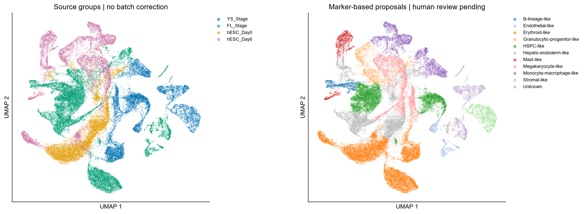
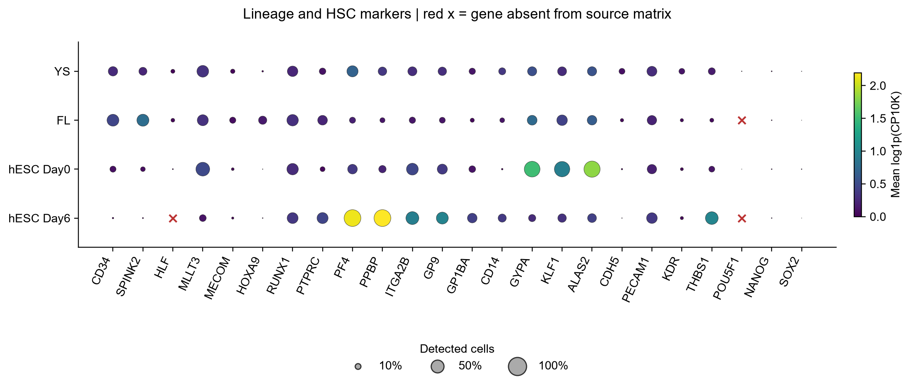

# AI analysis 1: joint four-group exploration

**Source report:** Human_HSC_exploration / Human_HSC_report.html. **Run date:** 2026-10-07. **Status:** completed exploratory AI analysis as reported; annotation candidates await human review.

[Original Chinese HTML report](original/Human_HSC_report.html) | [Report and figure checksums](source_manifest.json)

This English summary presents the supplied results without rerunning the analysis or changing annotations. The original HTML and selected display figures are archived unchanged. Download the HTML to view its embedded figures; original links to supporting local tables remain local. The exact AI model/version and full prompt history were not supplied in the report package.

## Analysis scope and parameters

Four UMI matrices were assembled by exact gene-symbol union, using source-prefixed cell IDs and source-specific gene-presence flags. FL contributed 17,677 cells, YS 11,021, hESC Day0 9,485 and hESC Day6 9,672. All **47,855 cells** were analyzed jointly and retained after the reported QC. Of 23,361 union genes, **23,059** passed the requirement for detection in at least three cells; 17,647 genes were shared across all four sources.

| Setting | Actual reported value |
|---|---|
| Backend | CPU PCA; no scVI or batch correction |
| HVGs | 2,000, seurat flavor |
| Representation | 30 principal components |
| n_neighbors | 15 |
| Leiden resolution / seed | 1.0 / 0 |
| Main partition | 37 clusters |
| Annotation | HPA-guided marker proposals; no human-reviewed label file |
| Code | Workbench v0.3.0, snapshot prefix 429eae2 |

The recorded latent=30 option means PCA components in this run, not scVI dimensions. QC used 500 <= detected genes < 6,000, UMI >= 1 and mitochondrial fraction < 10%, with no hemoglobin or total-count ceiling. All supplied cells passed; this does not establish how the source files had been filtered upstream. Doublet detection and ambient-RNA correction were not performed. No cell-cycle scoring/regression results are documented in the supplied run records and auxiliary scripts.

## Reported findings

The report describes a mixture of embryonic hematopoietic and nonhematopoietic programs rather than four purified HSC populations. Its cautious candidate labels include erythroid, megakaryocytic, HSPC-like, granulocytic progenitor, monocyte/macrophage, mast, B-lineage, endothelial, stromal and hepatic/endoderm-like populations, with Unknown retained.

Among captured hESC cells, the cautiously displayed erythroid-like fraction is 53.3% at Day0 and 15.9% at Day6; megakaryocyte-like fractions are 6.7% and 26.7%. Day6 also includes 24.6% monocyte/macrophage-like and 15.9% mast-like candidates. Unknown accounts for 37.7% of Day0 cells. These are descriptive fractions under the run's labeling scheme, not abundance-significance tests or evidence of cell conversion.

Joint clusters 4, 5 and 8 contain 5,227 cells, mainly FL, and were highlighted for further progenitor review. CD34/SPINK2 and HSC-associated genes support candidate programs but not long-term repopulating HSC function. The YS-rich cluster 25 also carries endothelial-associated evidence and needs finer lineage assessment.

The Day6 source lacks an HLF gene row; it is unavailable, not a measured zero. Reported Day6 detection fractions for CD34 and SPINK2 are 0.79% and 0.48%. The report therefore does not conclude that HSCs are absolutely absent.

Original plugin proposals and cautious AI display changes remain distinct. A FL-rich cluster proposed as Pluripotent-like was displayed as Unknown after evidence review, with cardiac-associated genes recorded as a hypothesis. These are AI revisions, not human review decisions.

## Sensitivity and limits

On the same graph, resolutions 0.6 and 1.4 produced 30 and 40 clusters, with ARI 0.783 and 0.909 relative to resolution 1.0. A shared-gene analysis produced 38 clusters with ARI 0.742 relative to the union-gene baseline. Weighted source dominance remained high (95.8% versus 96.9%). These are internal sensitivity measures, not annotation accuracy or evidence that technical effects were removed. No n_neighbors sweep is documented.

The local output directory also contains quantitative marker evidence, six descriptive source-group expression contrasts, cell metadata, stage records, dependency versions and reproducibility scripts. The descriptive contrasts are not donor-level DE; cluster Wilcoxon markers are exploratory. No donor-level condition p-values/FDR, trajectory or abundance-significance test is claimed. These supporting numerical datasets remain local and are not part of this report-only publication.

Original validation records report preserved input/count integrity and consistent cluster/composition totals. This archival operation verifies report/figure copies, not the original numerical computations. Useful remaining provenance includes model/prompt identity, actual human review, verified donor/capture mapping, cell-cycle correction evidence or an explicit policy exception, and neighbor-selection evidence. Historical results are not rewritten to match later knowledge-base defaults.

[Back to study records](../README.md).
