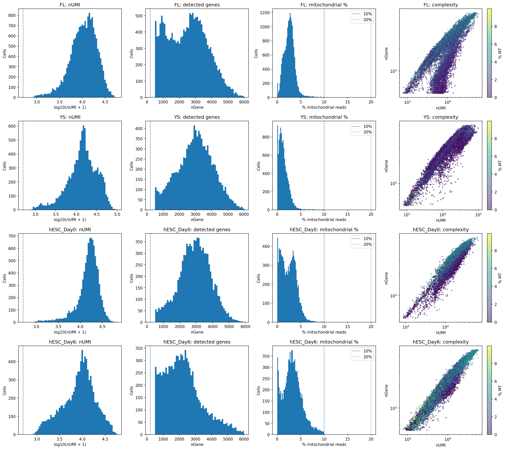
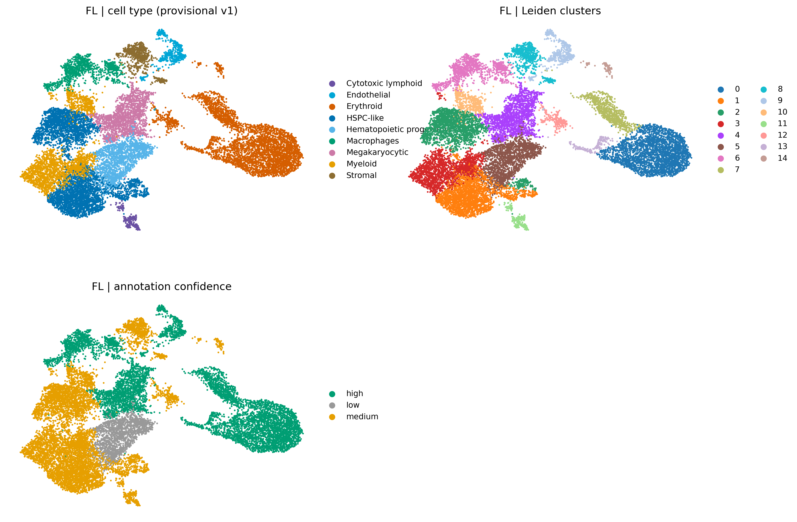
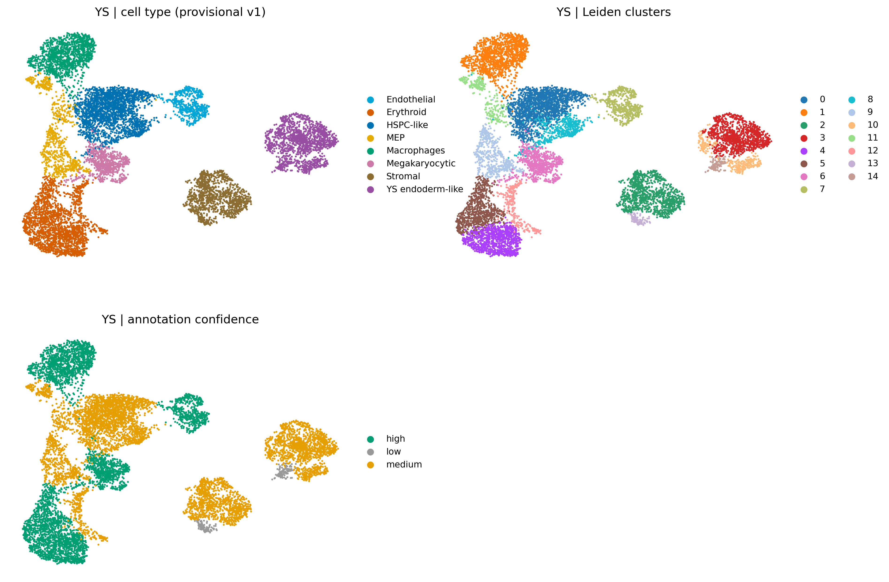
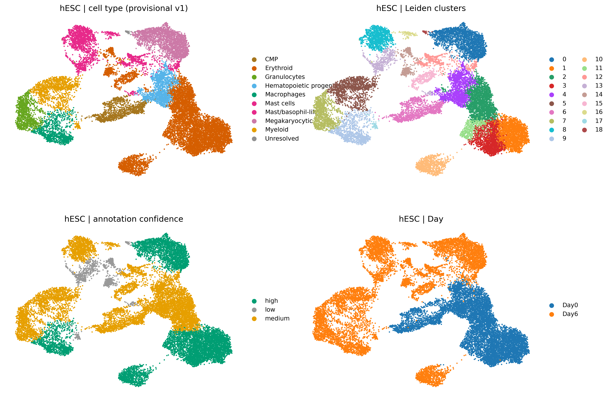

# GSE144024: manual-analysis results

**Submission:** manual-v1. **Recorded:** 2026-10-07. **Status:** final manual-analysis submission as designated by the user; additional computational evidence is listed separately.

This report faithfully presents the supplied QC report, marker-expression PDFs and annotated UMAPs. All seven submitted files are archived byte-for-byte. Labels, confidence displays and the original figure titles are preserved. The report does not re-annotate cells, reconstruct per-cell labels from pixels or compare earlier annotation drafts. The workflow included conversational assistance with code and marker references; this is the user-designated manual baseline, not an independently blinded ground-truth dataset.

## Scope and analysis groups

The record covers human fetal liver (FL), yolk sac (YS), and hESC-derived Day0/Day6 data associated with [GSE144024](https://www.ncbi.nlm.nih.gov/geo/query/acc.cgi?acc=GSE144024). The study reference is [Decoding Human Megakaryocyte Development](https://pubmed.ncbi.nlm.nih.gov/33340451/). FL and YS were analyzed separately. Day0 and Day6 were represented jointly in the hESC analysis, with day retained in the annotation display. These are three analysis groups; they do not establish three independent biological replicates.

The supplied materials support a descriptive QC and cell-annotation report. Donor/capture structure, exact input matrices and a replicate-aware condition comparison are not part of this submission.

## Dataset sizes and representation

| Analysis group | Cells in QC report | Cells reported after scVI | Retained genes reported | scVI latent dimensions reported | Leiden clusters displayed | Difference from QC-report cells |
|---|---:|---:|---:|---:|---:|---:|
| FL | 17,677 | 17,104 | 20,431 | 20 | 15 | 573 (3.24%) |
| YS | 11,021 | 10,516 | 20,719 | 20 | 15 | 505 (4.58%) |
| hESC | 19,157 | 18,529 | 20,924 | 15 | 19 | 628 (3.28%) |

The QC report contains **47,855 cells** in total, including 9,485 Day0 and 9,672 Day6 cells. Earlier user-provided object summaries report **46,149 cells** across the three scVI outputs, a difference of **1,706 cells**. This is a comparison of reported totals, not a reconstructed filtering log: the contribution of each QC or doublet step and post-analysis retention by hESC day cannot be assigned from the supplied files.

The earlier object summaries include `counts`, `X_scvi`, `X_umap`, Leiden labels and QC/doublet fields. These summaries establish reported contents, not a fresh inspection of h5ad files. The h5ad files were not supplied for this report.

FL's selected Leiden resolution is **0.5**, also printed on page 1 of its marker PDF. YS **1.0** and hESC **0.8** come from earlier workflow context and need the saved parameter records for executable provenance. The actual `n_neighbors`, UMAP settings, selected HVG list, batch registration and full training configuration were not supplied; knowledge-base defaults are not substituted for them.

## QC results

The [original HTML report](evidence/GSE144024_QC_report.html) states that QC metrics were reconstructed from gene-by-cell UMI count matrices. The extracted numerical table is available as [qc_summary.csv](tables/qc_summary.csv).

| Dataset | Cells | Median UMI | Median detected genes | Median mitochondrial fraction | 95th-percentile mitochondrial fraction | Median ribosomal fraction |
|---|---:|---:|---:|---:|---:|---:|
| FL | 17,677 | 11,156 | 2,555 | 2.60% | 4.41% | 35.41% |
| YS | 11,021 | 14,823 | 3,022 | 1.13% | 3.21% | 27.09% |
| hESC_Day0 | 9,485 | 16,533 | 2,937 | 2.40% | 5.08% | 39.32% |
| hESC_Day6 | 9,672 | 9,348 | 2,127 | 3.17% | 6.99% | 13.23% |

At the report's displayed precision, all four datasets have 0.0% of cells above 10% or 20% mitochondrial fraction, below 200 or 500 detected genes, or below 500 UMI. These values describe the matrices represented in the QC report; they do not establish the quality of all originally captured droplets or rule out doublets and other artifacts.

Day6 has lower median UMI and detected genes than Day0, and a different ribosomal distribution. These are descriptive differences. They do not alone show poorer quality, a technical batch effect, or a causal developmental change. The dashed reference thresholds in the QC plots were explicitly not automatic exclusion thresholds.

The HTML report lists cell-level QC tables and a separate summary CSV among its original outputs. Those source tables were not attached; the CSV here is extracted from the displayed HTML summary.

## Final submitted annotation results

The following labels are transcribed from the supplied annotation-figure legends. Counts refer to **displayed label categories**, not cell counts or quantitative composition.

| Group | Displayed categories | Labels in the supplied final figure |
|---|---:|---|
| FL | 9 | Cytotoxic lymphoid; Endothelial; Erythroid; HSPC-like; Hematopoietic progenitors; Macrophages; Megakaryocytic; Myeloid; Stromal |
| YS | 8 | Endothelial; Erythroid; HSPC-like; MEP; Macrophages; Megakaryocytic; Stromal; YS endoderm-like |
| hESC | 10 | CMP; Erythroid; Granulocytes; Hematopoietic progenitors; Macrophages; Mast cells; Mast/basophil-like; Megakaryocytic; Myeloid; Unresolved |

`HSPC-like` denotes a stem/progenitor-like annotation; `MEP` denotes megakaryocyte-erythroid progenitors; `CMP` denotes common myeloid progenitors. These are the submitted annotation terms, not claims of functional potency. Confidence categories are retained as qualitative annotation assessments, not calibrated probabilities.

### FL

The final FL display contains 15 Leiden clusters and nine broad label categories. It represents erythroid and megakaryocytic populations, HSPC-like and other hematopoietic progenitors, myeloid/macrophage populations, cytotoxic lymphoid cells, endothelium and stroma. Fine-grained states remain expressed through the supplied broad labels and confidence panel rather than new labels assigned in this report.

[FL marker-expression evidence: 19-page PDF](evidence/FL_marker_annotation.pdf).

### YS

The final YS display contains 15 Leiden clusters and eight label categories. It includes erythroid, megakaryocytic and MEP populations, HSPC-like cells, macrophages, endothelial cells, stroma and YS endoderm-like cells. These labels are reproduced as submitted, including the context-specific endoderm-like designation.

[YS marker-expression evidence: 19-page PDF](evidence/YS_marker_annotation.pdf).

### hESC Day0/Day6

The final hESC display contains 19 Leiden clusters and ten label categories. It includes erythroid and megakaryocytic populations, CMP and other hematopoietic progenitors, myeloid/granulocytic/macrophage populations, mast and mast/basophil-like populations, and the supplied unresolved category. The day panel shows nonuniform Day0/Day6 occupancy of the embedding. Without cell-type-by-day counts and a replicate-aware design, the figure does not quantify abundance changes, establish a trajectory or distinguish biological from technical contributions to separation.

[hESC marker-expression evidence: 23-page PDF](evidence/hESC_marker_annotation.pdf).

## Marker evidence and its interpretation

The three PDFs provide cluster maps and gene-expression UMAP panels. Panels include erythroid genes such as GYPA, ALAS2 and hemoglobins; megakaryocytic genes such as GP9, PF4 and GP1BA; progenitor-associated genes including CD34, KIT, HLF and RUNX1; endothelial, stromal, myeloid, lymphoid and mast-cell panels; and additional developmental-state panels in hESC. These lists describe the evidence panels, not a newly calculated positive-marker call for every annotated cell.

The workflow used HPA-guided marker review and the [gene-specificity screening skill](https://github.com/Sculptor815/scrnaseq-gene-specificity-screen) as reference support. Earlier workflow records document screening of 75 unique genes, including 46 genes located in the extracted official HPA marker panels, against 154 cell-type and 51 tissue references. The historical skill revision was `f9dace66d7b26e84afae98c7b6b3af7b6454bc7e`. These reference records are distinct from the current seven-file submission and should be linked to the exact final panel for complete provenance.

The screen evaluates whether a gene's reference cell-type peak falls within a selected group. It does not validate the identity of a query cluster or prove exclusive expression. Earlier records flag incomplete reference values for HBE1, HBG1 and RGS5 and limited coverage of embryonic/pluripotent states. A reference-screen limitation is not evidence that a gene is absent from these data.

No new DE, cell-level coexpression, expression fractions, cell-type proportions or model validation was calculated from the PDFs. Gene-specific color bars and UMAP geometry are qualitative evidence; they cannot replace the expression matrix.

## Knowledge-base completeness review

The submission provides a QC overview, marker-expression figures, annotation UMAPs, confidence displays and a day view. The main outstanding evidence is executable provenance and quantitative results, rather than another round of annotation revision.

See the prioritized [supplement checklist](MISSING_RESULTS.md) and its [machine-readable table](tables/missing_results.tsv). The highest-value additions are:

1. Final per-cell and cluster-level annotation exports linked to the exact h5ad.
2. Applied QC/doublet settings and stepwise retention, plus actual cell-cycle correction and model-training records.
3. Selected graph/clustering settings and any executed parameter-comparison gallery.
4. Computed DE tables, marker detection fractions, mean expression and cell-type-by-sample/day counts.

Missing attachments are not classified as failed analyses. If a check was not performed, record that directly rather than retroactively treating a knowledge-base default as an executed step.

## Artifact inventory and provenance

The [source manifest](source_manifest.json) records byte sizes, SHA-256 hashes and PDF page counts. Original figures and reports are archived unchanged; the QC table, dataset summary and label inventory are clearly identified as derived summaries. No raw sequencing data, expression matrices, models or credentials are committed.

- [Dataset and parameter summary](tables/analysis_summary.csv)
- [QC summary extracted from the supplied report](tables/qc_summary.csv)
- [Displayed cell-type labels](tables/displayed_cell_types.csv)
- [Missing-results checklist](MISSING_RESULTS.md)
- [All source files and their hashes](source_manifest.json)

This manual submission is preserved as its own record. Two later AI analyses will be added separately under the [study index](../README.md); they have not yet been submitted or scored.
