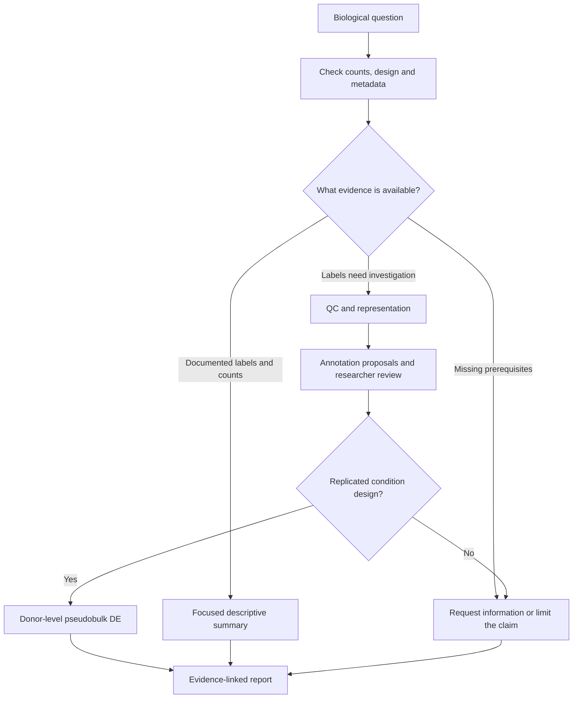

# Knowledge base v0.1.0: learning path

This learning edition explains the existing **v0.3.0 plugin**. The knowledge-base version is independent of the plugin version. All twelve cards are drafts awaiting scientific review. No model weights, runtime retrieval service or paid API calls are involved.

## Start here

1. Read cards 1-4 to connect a biological question to usable data and QC decisions.
2. Follow the [guided first run](FIRST_RUN.md) with the existing 400-cell artificial example. At each stage, inspect the recorded result before continuing.
3. Read cards 5-7 while reviewing the normalized representation, UMAP and annotation evidence.
4. Read cards 8-10 before making a condition-level claim or writing a report.
5. Use card 11 to turn your own experience into one new card. Read card 12 as preparation for a future enrichment tool, not as a command available today.

## Card index

| Card | Topic |
|---|---|
| 01 | [Turn a biological question into an observable comparison](cards/01-question.md) |
| 02 | [Understand counts, identifiers and metadata before analysis](cards/02-data.md) |
| 03 | [Review sequencing delivery without confusing it with cell QC](cards/03-delivery.md) |
| 04 | [Choose sample-aware quality filters and retain an exclusion ledger](cards/04-qc.md) |
| 05 | [Separate raw counts, normalization and feature selection](cards/05-normalization.md) |
| 06 | [Understand PCA, scVI, clustering and UMAP as different operations](cards/06-representation.md) |
| 07 | [Treat cell annotation as evidence review](cards/07-annotation.md) |
| 08 | [Estimate condition differences at the donor level](cards/08-de.md) |
| 09 | [Answer focused expression questions without overstating them](cards/09-expression.md) |
| 10 | [Build a conclusion from traceable observations](cards/10-report.md) |
| 11 | [Turn experience into retrievable decision knowledge](cards/11-knowledge.md) |
| 12 | [Plan enrichment as a future analytical extension](cards/12-enrichment.md) |

## Why the route branches

The expression-summary command currently also needs donor and condition columns. A descriptive research question alone does not bypass that input contract. Read the relevant card before choosing a route.

## How to review your knowledge base

Open [REVIEW_WORKSHEET.csv](REVIEW_WORKSHEET.csv). For each card, record corrections, source evidence and unresolved questions. Only the actual reviewer should record scientific approval. Approval applies to a version and scope, not every future use.

For your first contribution, choose one real decision: for example, when a low-RNA population should be investigated before filtering. Use the [experience template](templates/EXPERIENCE.md). Include a counterexample and the measurements that would change your decision. Do not turn a dataset-specific threshold into a universal rule.

[CATALOG.json](CATALOG.json) lists the cards; [SOURCE_MANIFEST.json](SOURCE_MANIFEST.json) pins the implementation files used. The original donor-design example remains available separately and is also a draft. Learning and execution checks do not replace scientific review.

See [execution checks and their limits](VALIDATION.md).
