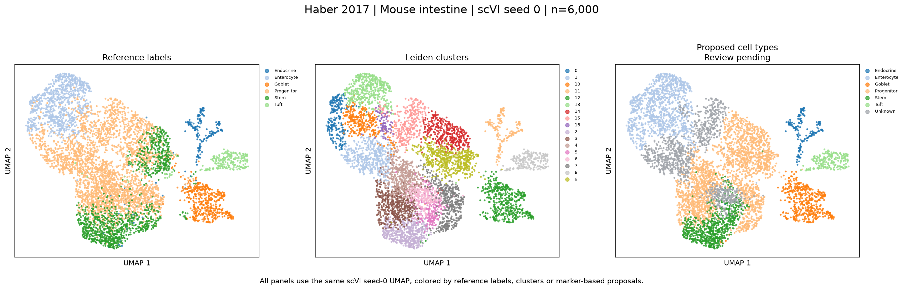
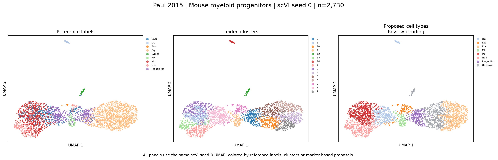
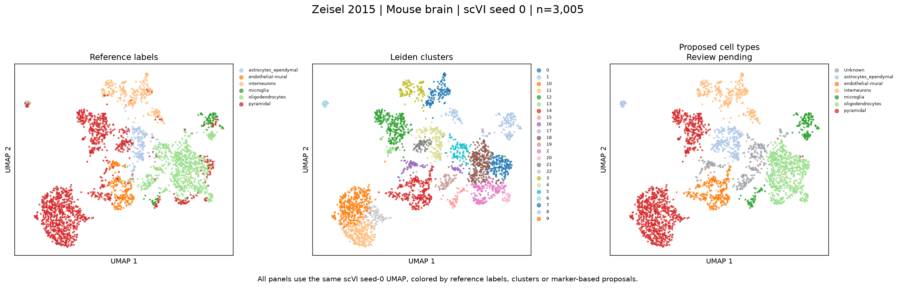
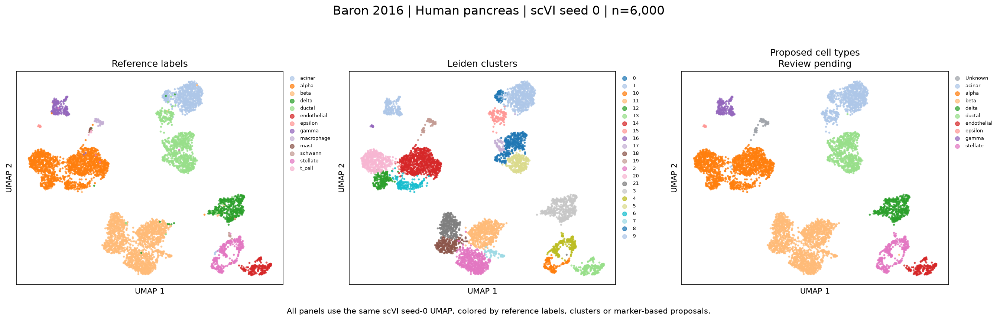

# Original publications and plugin comparisons

Compare the published study figures with the plugin's clusters and proposed cell types below. The published images load from their original websites, so they need an internet connection. Paul and Zeisel include source links because their image downloads were unavailable.

Each plugin comparison has three panels on the same scVI seed-0 UMAP: reference broad labels, Leiden clusters and proposed labels. Matching labels share colors; gray indicates Unknown. Published figures use the methods and cell subsets described in their captions, including t-SNE and BackSPIN heatmaps.

The proposed labels come from the historical marker workflow. [HPA-guided review packets](../benchmarks/README.md) provide marker measurements and forms for the next review step. That review is pending. Seed 0 was fixed for all five comparisons.

## Kang et al. 2018

[Original publication / figure](https://pmc.ncbi.nlm.nih.gov/articles/PMC5784859/figure/F3/) · DOI: 10.1038/nbt.4042

Figure 3a: t-SNE; PBMC conditions and estimated types. The public processed copy has 24,673 cells; the paper singlet counts total 24,305. Cell-version equivalence is unresolved.

<table><tr><th>Original publication figure (external)</th><th>Our UMAP and labels</th></tr>
<tr><td><a href="https://pmc.ncbi.nlm.nih.gov/articles/PMC5784859/figure/F3/"></a></td><td><a href="figures/kang-comparison.png"></a></td></tr></table>

[Marker heatmap](../benchmarks/evidence/kang/marker_heatmap.png) · [Marker measurements](../benchmarks/evidence/kang/marker_expression.csv) · [Pending review form](../benchmarks/evidence/kang/hpa_review.template.csv) · [Per-type scores, legacy](../benchmarks/legacy/kang/scvi_0_annotation_per_type.csv)

## Haber et al. 2017

[Original publication / figure](https://pmc.ncbi.nlm.nih.gov/articles/PMC6022292/figure/F1/) · DOI: 10.1038/nature24489

Figure 1b: t-SNE of 7,216 epithelial cells. The benchmark uses the 9,842-cell regions copy. The paper panel is contextual and is not the same selected cells.

<table><tr><th>Original publication figure (external)</th><th>Our UMAP and labels</th></tr>
<tr><td><a href="https://pmc.ncbi.nlm.nih.gov/articles/PMC6022292/figure/F1/"></a></td><td><a href="figures/haber-comparison.png"></a></td></tr></table>

[Marker heatmap](../benchmarks/evidence/haber/marker_heatmap.png) · [Marker measurements](../benchmarks/evidence/haber/marker_expression.csv) · [Pending review form](../benchmarks/evidence/haber/hpa_review.template.csv) · [Per-type scores, legacy](../benchmarks/legacy/haber/scvi_0_annotation_per_type.csv)

## Paul et al. 2015

[Original publication / figure](https://doi.org/10.1016/j.cell.2015.11.013) · DOI: 10.1016/j.cell.2015.11.013

The publisher and image service returned HTTP 403 when the original figure was requested. The comparison below uses the reference labels supplied with the downloaded data.

**Original image status:** publisher figure access blocked; link only. The image below is solely our replot.



[Marker heatmap](../benchmarks/evidence/paul/marker_heatmap.png) · [Marker measurements](../benchmarks/evidence/paul/marker_expression.csv) · [Pending review form](../benchmarks/evidence/paul/hpa_review.template.csv) · [Per-type scores, legacy](../benchmarks/legacy/paul/scvi_0_annotation_per_type.csv)

## Zeisel et al. 2015

[Original publication / figure](https://linnarssonlab.org/cortex/) · DOI: 10.1126/science.aaa1934

The author site describes a BackSPIN expression heatmap; the linked image returned HTTP 403. The downloaded table includes seven major classes as well as finer cluster labels, which represent different annotation levels.

**Original image status:** author heatmap link verified; asset fetch blocked. The image below is solely our replot.



[Marker heatmap](../benchmarks/evidence/zeisel/marker_heatmap.png) · [Marker measurements](../benchmarks/evidence/zeisel/marker_expression.csv) · [Pending review form](../benchmarks/evidence/zeisel/hpa_review.template.csv) · [Per-type scores, legacy](../benchmarks/legacy/zeisel/scvi_0_annotation_per_type.csv)

## Baron et al. 2016

[Original publication / figure](https://pmc.ncbi.nlm.nih.gov/articles/PMC5228327/figure/F1/) · DOI: 10.1016/j.cels.2016.08.011

Figure 1d: human donor 1 t-SNE; other panels show heatmaps and mouse data. The benchmark combines four human donor files (8,569 cells before added QC); this is not the donor-1 paper panel. Paper count differences remain unresolved.

<table><tr><th>Original publication figure (external)</th><th>Our UMAP and labels</th></tr>
<tr><td><a href="https://pmc.ncbi.nlm.nih.gov/articles/PMC5228327/figure/F1/"></a></td><td><a href="figures/baron-comparison.png"></a></td></tr></table>

[Marker heatmap](../benchmarks/evidence/baron/marker_heatmap.png) · [Marker measurements](../benchmarks/evidence/baron/marker_expression.csv) · [Pending review form](../benchmarks/evidence/baron/hpa_review.template.csv) · [Per-type scores, legacy](../benchmarks/legacy/baron/scvi_0_annotation_per_type.csv)

## Re-render locally

```text
python scripts/render_comparisons.py --outdir work/comparisons
```

Open the five PNGs in the new output directory. Rendering uses the committed coordinate and label tables; model fitting is a separate step. Existing output folders and destinations inside `docs/` or `benchmarks/` are refused. Figure sources are recorded in [original_figures.json](../benchmarks/original_figures.json).
